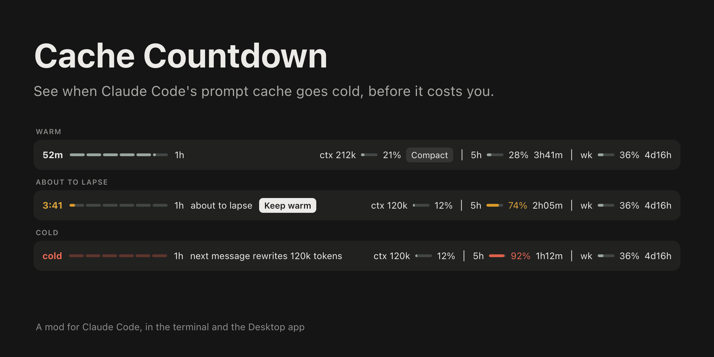
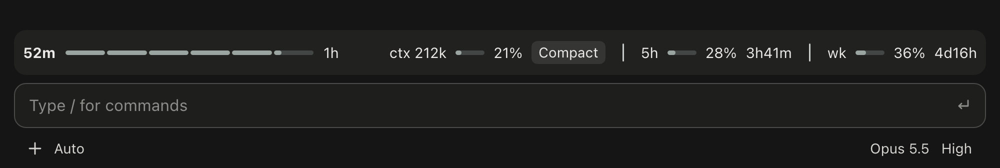

# Cache Countdown

A Claude Code mod that shows how long the prompt cache stays warm, as a fuse above the prompt. It draws in the terminal and in the Code tab of the Claude Desktop app.



Anthropic's prompt cache has two lifetimes, 5 minutes and 1 hour, priced differently. Every request of the main conversation refreshes the entry. Once it lapses, the next request pays to write the whole context to the cache again. This mod shows how long you have left, and what it costs when the time runs out.

## Install

Requires Claude Code v2.1.287 or later.

In a Claude Code session:

```text
/plugin marketplace add iamomiid/cache-countdown
/plugin install cache-countdown@cache-countdown
```

Or from your shell:

```bash
claude plugin marketplace add iamomiid/cache-countdown
```

```bash
claude plugin install cache-countdown@cache-countdown
```

To try it for one session without installing, clone the repository and load the folder:

```bash
claude --plugin-dir ./cache-countdown
```

The band appears after the first reply of a conversation.

A mod runs with your permissions. To see what this one hooks and calls before loading it, run `claude plugin validate` on the cloned folder. It reads the session transcript, runs `tail` on it, and makes a model request only when you press Keep warm.

## What it shows

One row above the prompt. In the Desktop app:



In a terminal:

```text
52m ━━━━━━━━━━━━━━━━━━━━━─── 1h   ctx 212k 21%  │  5h 28% 3h41m  │  wk 36% 4d16h
```

Both images on this page are illustrations drawn to match the app, with example figures.

The row holds:

- **The time left**, then a fuse that shortens as the cache ages. In the Desktop app the fuse is a hairline with a notch every 10 minutes (1h) or every minute (5m). In the terminal it is a run of line characters.
- **The lifetime in play**, `5m` or `1h`.
- **A note when something needs you**: `about to lapse` in the last five minutes (1h) or last minute (5m), `next message rewrites 212k tokens` once the cache is cold, and `last request rewrote 203k tokens` after a request that missed the cache.
- **Meters**: context with the tokens in use and the share of the window, then each rate limit window the account reports (`5h`, `wk`, and any other) with the share used and the time until it resets.

Nothing is colored while all is well. The time and fuse take the warning color when the cache is about to lapse and the error color when it is cold. A meter takes the warning color at 70% and the error color at 90%.

It also shows a toast shortly before the cache lapses and when it does, for conversations of 20k tokens or more. `/cache-countdown` prints the figures as text, for surfaces that draw no band (VS Code, `claude -p`).

If another mod draws above the prompt too, its row stays, under this one.

## Buttons

- **Keep warm** appears while the cache is about to lapse. It asks the model one short question over the conversation as it was last sent, which reads the cache and restarts its lifetime. That request is real usage: the whole context at the cache-read price. A toast says how many tokens were read. If the request wrote the context again instead of reading it, the toast says so and the countdown stays as it was.
- **Compact** appears beside the context meter once the conversation holds more than 200k tokens, and whenever the cache is cold and the conversation holds 20k tokens or more. It runs `/compact`, as if you had typed it, with no confirmation step. Pressed while a turn is running, it waits for the turn to end. Compacting a cold conversation still reads the whole context once, as any next message would; what it saves is carrying that context into every message after.

## Options

Set them with `/plugin configure cache-countdown@cache-countdown`, or in the `/config` panel.

| Option | Values | Default | What it does |
| :- | :- | :- | :- |
| `ttl` | `auto`, `5m`, `1h` | `auto` | Which lifetime to count down. `auto` reads it from the transcript. |
| `toast` | `true`, `false` | `true` | Toasts before and at expiry. |

## How it works

- The countdown starts from the moment the last main-conversation request was sent. Subagent requests have a cache of their own and do not reset it.
- The lifetime is read from the session transcript, where each response records how many tokens it wrote under `ephemeral_5m_input_tokens` and `ephemeral_1h_input_tokens`. Until that is known, the fuse counts the 5 minute lifetime first and the 1 hour lifetime after it, and says so.
- The transcript's tail is read with `tail`. Where `tail` is missing, as on Windows, the whole file is read, which works up to 4 MiB. Past that, the lifetime stays unconfirmed unless `ttl` is set.
- A model switch clears the countdown, since the cache is per model.
- Context and rate limit figures are the ones Claude Code reports after each turn.
- On `/resume` and `/branch` the countdown starts from the resumed conversation's last response.

## Limits

- The countdown is an estimate. Claude Code does not tell a mod when an entry lapses, and anything that shortens a lifetime on Anthropic's side is not seen.
- Keep warm depends on its request reading the main conversation's cache entry. The toast after each press reports whether it did.
- The mods API is early access and changes between Claude Code releases. This mod is tested with v2.1.288.

## Develop

Load the folder with `--plugin-dir`, or name it in `CLAUDE_CODE_PLUGIN_DIRS` under `env` in `~/.claude/settings.json` for sessions the Desktop app starts. Claude Code reloads the mod when a file changes.

```bash
claude plugin validate .
```

```bash
claude plugin test .
```

## License

MIT. See [LICENSE](LICENSE).
